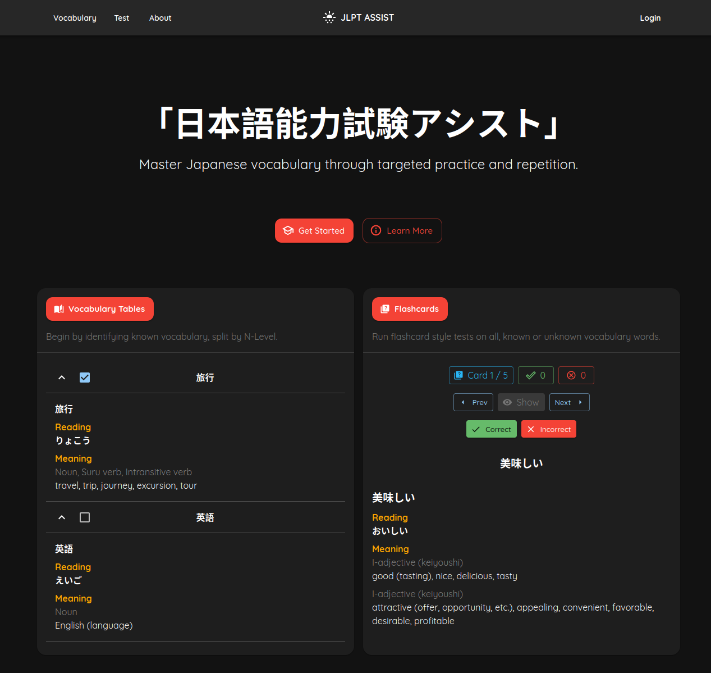

# JLPT Assist
A flashcard and progress-tracking app for Japanese learners preparing for the Japanese Language Proficiency Test (JLPT).
Review vocabulary by level (N5–N1), run custom flashcard tests, save test results and keep track of your language learning journey.

Developer: Ajmain Ahmed

# Live Site: https://jlptassist.vercel.app

# Features
- Secure login & authentication NextAuth and Google OAuth 2.0
- Desktop & mobile friendly design
- Interactive vocabulary tables for each JLPT level (N1-N5)
- All progress and results saved to the Supabase - data persists across devices, synced in real-time
- Flashcard style tests against all, known or unknown cards, with a built-in randomiser
- Click any test card to see its kanji components via KanjiAPI.dev
- Freely view or delete test result records on the profile page
- Responsive UI built with Material UI components

# Stack
- Framework: Next.js 15
- Frontend: React, Material UI
- Authentication: NextAuth.js + Google OAuth 2.0
- Database: Supabase, RLS enabled for all tables (PostgreSQL)
- Styling: CSS + Material UI theming
- Deployment: Vercel
- Language: JavaScript
- Rate limiting: Redis

# Run locally

Clone repo:
git clone https://github.com/gdaftrnoon/jlpt-assist.git
cd jlpt-assist

Install dependencies:
npm install

Create .env.local file with credentials for the following:
- AUTH_SECRET
- AUTH_GOOGLE_ID
- AUTH_GOOGLE_SECRET
- UPSTASH_REDIS_REST_URL
- UPSTASH_REDIS_REST_TOKEN
- SUPABASE_URL
- SUPABASE_SERVICE_KEY

Note: Supabase anon key is not used in this app, all DB operations are server-side

Start dev server:
npm run dev